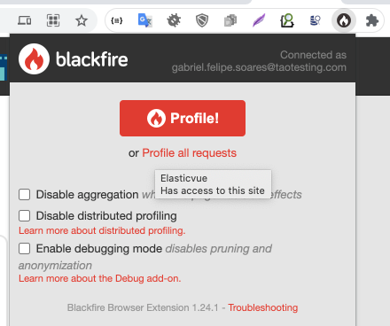

# Blackfire

The purpose of this repository is to help run **Blackfire** locally.

### Setup your configs

Create a copy of `docker-compose.override-sample.yml` as `docker-compose.override.yml` with your credentials and network to test.

### Start Blackfire container

```shell
docker-compose up -d
```

Connect your blackfire to the `target container` network

```shell
docker network connect myNetwork blackfire
```

### Install blackfire agent

In the PHP application container that you want to profile, do:

You might need to install `gnupg2` before. 

```shell
apt-get update && apt-get install -y gnupg2
```

After, install the agent:

```shell
BLACKFIRE_CLIENT_ID="XXXXXX" \
BLACKFIRE_CLIENT_TOKEN="XXXXXX" \
BLACKFIRE_SERVER_ID="XXXXXX" \
BLACKFIRE_SERVER_TOKEN="XXXXXX" \
bash -c "$(curl -L https://installer.blackfire.io/installer.sh)"
```

### Install Probe: 

Check updated info: https://blackfire.io/docs/php/integrations/php-docker

Install it on your PHP container (Or add it to the PHP Docker file)

```shell
version=$(php -r "echo PHP_MAJOR_VERSION.PHP_MINOR_VERSION;") \
&& architecture=$(uname -m) \
&& curl -A "Docker" -o /tmp/blackfire-probe.tar.gz -D - -L -s https://blackfire.io/api/v1/releases/probe/php/linux/$architecture/$version \
&& mkdir -p /tmp/blackfire \
&& tar zxpf /tmp/blackfire-probe.tar.gz -C /tmp/blackfire \
&& mv /tmp/blackfire/blackfire-*.so $(php -r "echo ini_get ('extension_dir');")/blackfire.so \
&& printf "extension=blackfire.so\nblackfire.agent_socket=tcp://blackfire:8307\n" > $PHP_INI_DIR/conf.d/blackfire.ini \
&& rm -rf /tmp/blackfire /tmp/blackfire-probe.tar.gz
```

## Config the agent

```shell
sudo blackfire agent:config --server-id=XXXX --server-token=XXXX
```

## Restart agent

In the PHP Application:

```shell
rm -rf /var/run/blackfire/agent.sock
sudo service blackfire-agent restart
```

## Execute profiling

### Via curl

Inside the PHP container where the prob and backfire agent is installed, call your application. Examples:

```shell
blackfire curl --title="My Profiling" http://my-local-url
```

### Via Browser

Install Blackfire plugin for Chrome: https://blackfire.io/docs/integrations/browsers/chrome 

Now you will be able to profile using the new tool available:



## Check logs

```shell
docker-compose logs -f blackfire
```

## Some references

- https://blackfire.io/docs/up-and-running/docker
- https://blackfire.io/docs/php/integrations/php-docker
